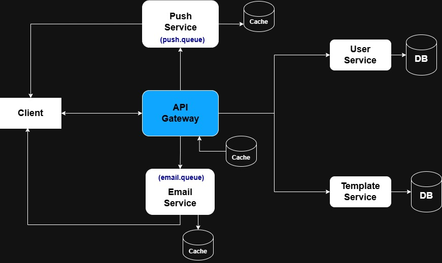

# Distributed Notification System (Microservices + RabbitMQ)

A production-minded, event-driven notification platform built as a set of NestJS microservices that communicate asynchronously via RabbitMQ. It delivers **email** and **push** notifications, manages **users & preferences**, renders **templates**, and exposes a **Gateway** API with **status tracking** callbacks.

> Each service has its own `README.md` for service-specific details. This root README gives you the big picture, local setup, environment, topology, and common workflows—then links you to each service.

---

## Contents

- [Architecture](#architecture)
- [Queues & Topology](#queues--topology)
- [Services Overview](#services-overview)
- [Running Locally](#running-locally)
- [Environment](#environment)
- [Gateway API (Quick Guide)](#gateway-api-quick-guide)
- [Status Callbacks & Tracking](#status-callbacks--tracking)
- [Email & Push Services](#email--push-services)
- [Troubleshooting](#troubleshooting)
- [Contributors](#contributors)
- [Service READMEs](#service-readmes)

---

## Architecture



- **Gateway**: single entrypoint, validates/authenticates, renders templates via Template service, fetches user contact/prefs, chooses channels, publishes RMQ messages, exposes **status** APIs.
- **User**: stores user contact info, device tokens, and preferences.
- **Template**: stores templates and variables; Gateway uses it to produce final `subject/body`.
- **Email**: consumes from `email.queue`, sends via SendGrid, retries, idempotency with Redis, posts delivery status back to Gateway.
- **Push**: consumes from `push.queue`, sends via Firebase Cloud Messaging (FCM), retries, idempotency with Redis, posts delivery status back to Gateway.

---

## Queues & Topology

**Exchange:** `notifications.direct` (type: `direct`)

**Queues & bindings:**

```
notifications.direct
├── (rk) notifications.email  →  email.queue
├── (rk) notifications.push   →  push.queue
└── failed.queue (DLQ)        →  bound with rk: failed.queue
```

- Both **Email** and **Push** services declare:
  - durable queues
  - dead-letter exchange: `notifications.direct`
  - dead-letter routing key: `failed.queue`
- Gateway **publishes** with routing keys:
  - `notifications.email`
  - `notifications.push`

---

## Services Overview

- **Gateway** (`/gateway`): REST API, JWT auth, status cache, RMQ producers.  
  Swagger: `http://localhost:3000/api/v1/docs`
- **User** (`/user`): user CRUD, device tokens, preferences; contact aggregation.  
  Swagger: `http://localhost:3001/api/docs`
- **Email** (`/email`): RMQ consumer, SendGrid sender, circuit breaker & retries, Redis idempotency, status callback.  
  Swagger: `http://localhost:3003/api/docs`
- **Push** (`/push`): RMQ consumer, FCM sender, circuit breaker & retries, Redis idempotency, status callback, test route.  
  Swagger: `http://localhost:3004/api/docs`
- **Template** (`/template`): template CRUD, variable substitution (used by Gateway).  
  Swagger: (see service README)

See each service’s README for routes, env, and implementation notes:

- [Gateway README](./gateway/README.md)
- [User README](./user/README.md)
- [Email README](./email/README.md)
- [Push README](./push/README.md)
- [Template README](./template/README.md)

---

## Running Locally

### 1) Prerequisites

- Node 20+
- pnpm or npm
- Docker + Docker Compose (for RabbitMQ/Redis)
- SendGrid API key (for Email)
- Firebase service account JSON (for Push)
- Optional: local Redis if not using docker compose

### 2) Start infrastructure

At repo root:

```bash
docker compose up -d
# typically brings up RabbitMQ (5672/15672) and Redis (6379)
```

### 3) Install deps (root)

```bash
pnpm install
# or
npm install
```

### 4) Configure environment

Create `.env` files in services you will run (see [Environment](#environment)).

### 5) Start services (dev)

In separate terminals:

```bash
# Gateway
pnpm --filter gateway start:dev

# User
pnpm --filter user start:dev

# Template
pnpm --filter template start:dev

# Email
pnpm --filter email start:dev

# Push
pnpm --filter push start:dev
```

---

## Environment

Common variables you will encounter:

| Var                        | Service(s)           | Example                                                   |
| -------------------------- | -------------------- | --------------------------------------------------------- |
| `RABBITMQ_URL`             | gateway, email, push | `amqp://localhost:5672`                                   |
| `JWT_SECRET`               | gateway              | `secret-secret`                                           |
| `GATEWAY_STATUS_SECRET`    | gateway              | a strong random string; used by Email/Push to POST status |
| `USER_SERVICE_URL`         | gateway              | `http://localhost:3001`                                   |
| `TEMPLATE_SERVICE_URL`     | gateway              | `http://localhost:3002`                                   |
| `SENDGRID_API_KEY`         | email                | <your_SendGrid_key>                                       |
| `REDIS_URL`                | email, push          | `redis://localhost:6379`                                  |
| `FIREBASE_SERVICE_ACCOUNT` | push                 | entire JSON (stringified) for FCM admin SDK               |

**Notes**

- Email/Push **post back** to Gateway with `x-status-secret: ${GATEWAY_STATUS_SECRET}`.
- Email/Push both rely on Redis for idempotency (`processed:{request_id}`).

---

## Gateway API (Quick Guide)

Swagger: `http://localhost:3000/api/v1/docs`

### Auth

```bash
# Login (example – see /gateway auth module)
POST /api/v1/login
-> { access.token, access.expiresIn, user {...} }
```

Use `Authorization: Bearer <access.token>` for authenticated routes.  
If you don’t provide JWT, you can include `user_id` in the notification payload (the Gateway will accept this when auth is absent).

### Create / Update Users (via Gateway → User service)

```bash
# Create a user (directly against User service or via Gateway clients)
POST /users

# Add a device token (through Gateway Users module)
POST /api/v1/users/devices
Authorization: Bearer <token>
{
  "device_token": "<FCM_TOKEN>"
}
```

### Send Notifications

#### Unified create payload

```json
POST /api/v1/notifications
Content-Type: application/json
Authorization: Bearer <token>   # optional if you pass user_id

{
  "notification_type": "email" | "push",   // omit to follow user preferences
  "user_id": "uuid (optional if JWT present)",
  "template_code": "register_hng",
  "variables": {
    "name": "John Doe",
    "link": "https://hng.tech/internship"
  },
  "request_id": "optional-uuid-or-string",
  "priority": 5,
  "metadata": {
    "campaign": "fall-2025",
    "locale": "en-NG"
  }
}
```

**Routing logic:**

- If `notification_type` is:
  - `"email"` → only email
  - `"push"` → only push
  - **omitted** or **null** → use user preferences (`email_notifications`, `push_notifications`)
- Gateway:
  - fetches user contact + preferences from **User Service**
  - renders `subject/body` using **Template Service**
  - publishes to `notifications.email` and/or `notifications.push`
  - returns `{ success, notification_id, channels }`

**Examples**

```bash
# Email only
curl -X POST http://localhost:3000/api/v1/notifications   -H 'Content-Type: application/json'   -H 'Authorization: Bearer <token>'   -d '{
    "notification_type": "email",
    "template_code": "register_hng",
    "variables": { "name": "John Doe", "link": "https://hng.tech/internship" }
  }'
```

```bash
# Follow preferences (both if enabled)
curl -X POST http://localhost:3000/api/v1/notifications   -H 'Content-Type: application/json'   -H 'Authorization: Bearer <token>'   -d '{
    "template_code": "register_hng",
    "variables": { "name": "John Doe", "link": "https://hng.tech/internship" }
  }'
```

**Validation behavior (Gateway):**

- If you force a channel but required contact is missing (no email / no device tokens) → **400**.
- If you provide an unknown `notification_type` → it defaults to **preferences** (backward-compat).
- Missing template variables → **400** with the list of missing placeholders.

---

## Status Callbacks & Tracking

**Who calls what?**

- **Email/Push services** POST delivery results **to Gateway**:
  - `POST /api/v1/notifications/email/status`
  - `POST /api/v1/notifications/push/status`
  - Must include header: `x-status-secret: ${GATEWAY_STATUS_SECRET}`

**Payload shape**

```json
{
  "notification_id": "uuid-or-string",
  "status": "delivered" | "pending" | "failed",
  "timestamp": "ISO-8601",
  "error": "optional failure reason"
}
```

**Read status (client-facing):**

- **Combined**:
  - `GET /api/v1/notifications/status/:notification_id?channel=email|push`
  - Returns `{ email: <dto|null>, push: <dto|null> }` if `channel` omitted.
- **Per channel (shortcut)**:
  - `GET /api/v1/notifications/email/status/:notification_id`
  - `GET /api/v1/notifications/push/status/:notification_id`

Statuses are cached in Gateway (TTL ~2 days). If you query too early, you may see `null` until the microservice posts back.

---

## Email & Push Services

### Email Service

- Consumes `email.queue` (`rk: notifications.email`)
- Ensures topology on boot (exchange, queues, DLQ bindings)
- Validates payload shape
- Retries with backoff; circuit-breaker around SendGrid
- Idempotency via Redis (`processed:{request_id}`)
- Posts status back to Gateway:
  - `POST /api/v1/notifications/email/status` with `x-status-secret`

Swagger: `http://localhost:3003/api/docs`  
More: [Email README](./email/README.md)

### Push Service

- Consumes `push.queue` (`rk: notifications.push`)
- FCM via Firebase Admin SDK; validates device tokens
- Retries with backoff; circuit-breaker
- Idempotency via Redis
- Posts status back to Gateway:
  - `POST /api/v1/notifications/push/status` with `x-status-secret`
- Test route (for local sanity):
  - `POST /push/test` (Swagger: `http://localhost:3004/api/docs`)

More: [Push README](./push/README.md)

---

## Troubleshooting

- **406 PRECONDITION_FAILED on queue declare**  
  You are declaring a queue with different arguments than existing.  
  **Fix:** keep DLX args consistent everywhere (e.g., `x-dead-letter-exchange=notifications.direct`, `x-dead-letter-routing-key=failed.queue`) or delete the queue and redeploy.
- **No push received; “Removing N invalid tokens”**  
  FCM rejected a token. Ensure you registered a **current** device token via Gateway `POST /api/v1/users/devices`, and the Push service uses the **correct** `FIREBASE_SERVICE_ACCOUNT` for the same Firebase project as the token.
- **401 calling status endpoints**  
  Status POST is **service-to-service** with `x-status-secret`. If missing or mismatched you’ll get `401`.
- **Template variable errors**  
  The Gateway enforces missing placeholder validation (e.g., `{{name}}`); include all required variables.
- **JWT expired**  
  Access tokens are short-lived by design. Re-login or use the refresh flow (see Gateway auth docs).

---

## Contributors

- [**@emmanueldev247**](https://github.com/emmanueldev247)
- [**@iamArvy**](https://github.com/iamArvy)
- [**@911Dev-Niyi**](https://github.com/911Dev-Niyi)
- [**@PaulsCreate**](https://github.com/PaulsCreate)

---

## Service READMEs

- **Gateway**: [./gateway/README.md](./gateway/README.md) — auth, notification API, status APIs, RMQ producers
- **User**: [./user/README.md](./user/README.md) — user CRUD, device tokens, preferences
- **Email**: [./email/README.md](./email/README.md) — SendGrid, DLQ, idempotency, topology
- **Push**: [./push/README.md](./push/README.md) — FCM, DLQ, idempotency, test route
- **Template**: [./template/README.md](./template/README.md) — template storage, variable substitution, versions

---

### TL;DR

1. Start infra: `docker compose up -d`
2. Run services (see **Running Locally**)
3. Create/login a user → add device token
4. `POST /api/v1/notifications` (email | push | both)
5. Poll `GET /api/v1/notifications/status/:notification_id`
6. Inspect Email/Push logs (and DLQ if any) for delivery outcomes`

That’s it 🚀
